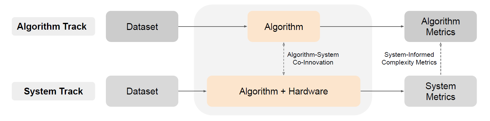
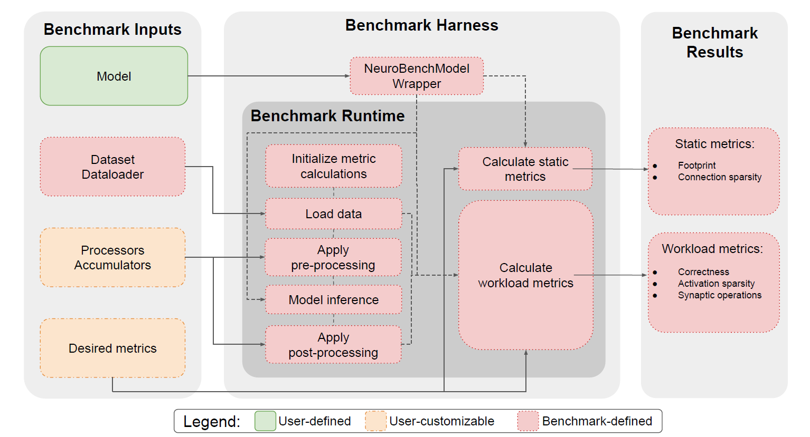
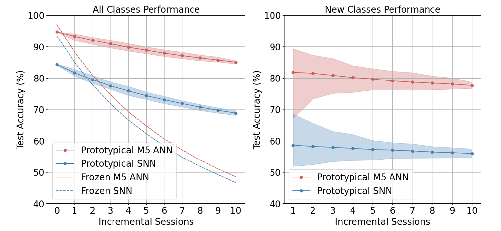
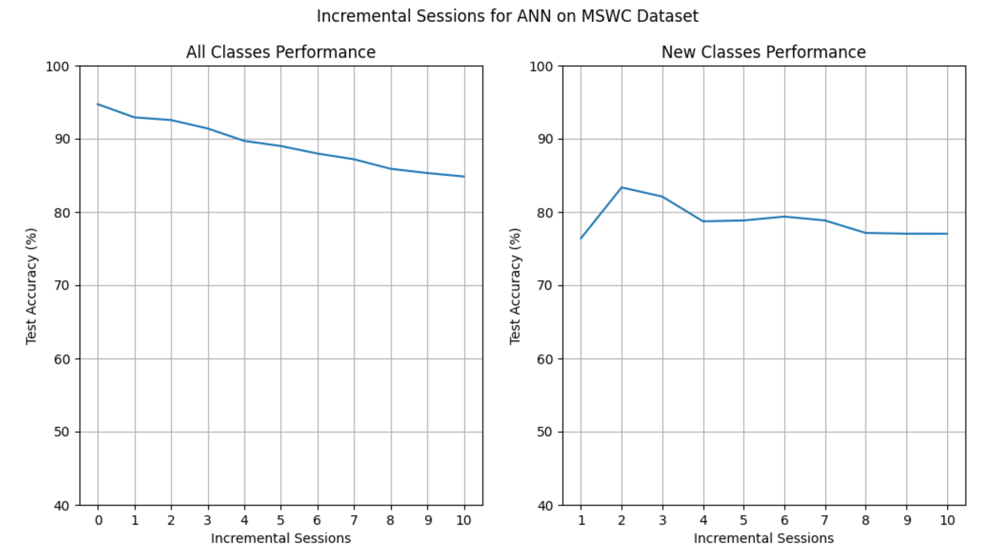
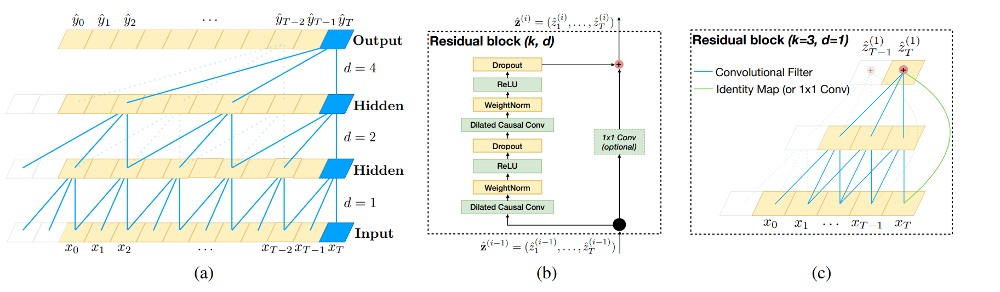
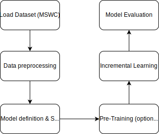
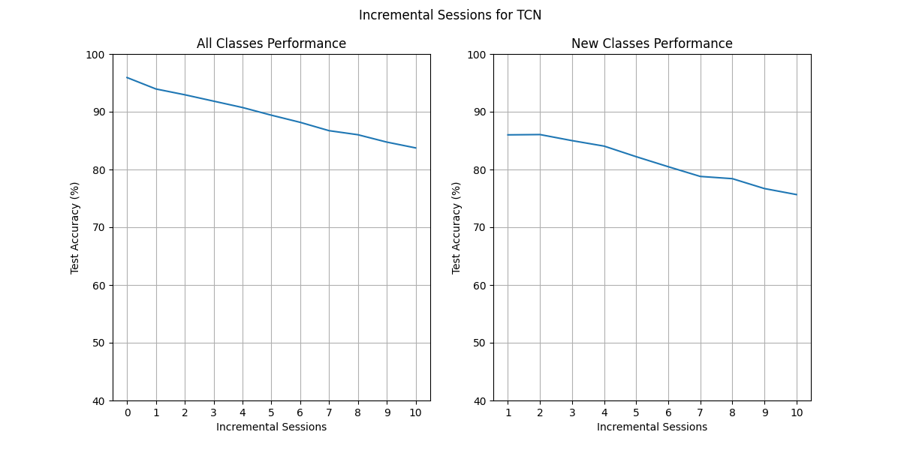

# neurobench reproducible blog
# NeuroBench: A Framework for Benchmarking Neuromorphic Computing Algorithms and Systems
## Introduction
Recent years, the need for an evaluating system like NeuroBench in neuromorphic computing arises from the lack of standardized benchmarks in the field, making it challenging to accurately measure technological advancements, compare performance with conventional methods, and identify promising future research directions. In this blog, a new evaluation system for neuromorphic computing algorithms, NeuroBench, is introduced. We aim to provide the reader with a clear picture of the function of NeuroBench by explaining the structure of it, testing its efficiency on M5 Artificial Neural Network (M5 ANN) and Temporal Convolutional Network (TCN), and analyzing its advantages towards traditional evaluation metrics. 
  
In our reproducibility project, we mainly used 4 criteria to reproduce the paper: **Reproduction**, **New algorithm variant**, **Hyperparameter analysis**, **New code variant**. We first used the existing M5 ANN codes on the github website of NeuroBench to evaluate the proposed benchmark - Keyword Few-Shot Class-Incremental Learning (FSCIL). Then we substituted the ANN with a new algorithm, TCN, to check the generalizability of the benchmark. After that, we tuned the hyperparams of the network and changed the benchmark metrics with our own testing function to evaluate the results. During the course of the project, we also found a memory overflow problem in the codes which is provided by the authors of the article. We reflected it to the authors and had the bug get fixed.

The project team engaged in a collaborative problem-solving process to identify and address the key challenges associated with the source codes and the variant codes. Through a joint effort, the team was able to effectively define and tackle the reporduction and the new algorithm and code variation.


## Reproduction
### a.	NeuroBench
NeuroBench is a benchmark framework designed for evaluating neuromorphic computing algorithms and systems, aiming to standardize the assessment of neuromorphic approaches in both hardware-independent and hardware-dependent settings. The advantages of NeuroBench lie in its inclusive and systematic methodology, providing a common set of tools for benchmark measurement that allows for objective comparisons between different neuromorphic models. By offering a structured framework for evaluation, NeuroBench facilitates the measurement of performance, enables comparisons with conventional methods, and helps identify promising research directions in the field of neuromorphic computing.

<figure style="text-align: center;">
  
  <figcaption style="font-weight: bold;">Figure 1. Two main tracks of NeuroBench [1]</figcaption>
</figure>

The structure of NeuroBench, as depicted in Fig 1 of the article, consists of two tracks: the algorithm track and the system track. The algorithm track focuses on hardware-independent algorithm prototyping to identify promising methods, which inform system design for optimization and relevant benchmarking. On the other hand, the system track enables the optimization and evaluation of performant implementations, providing feedback to refine algorithmic complexity modeling and analysis. The interplay between these tracks creates a virtuous cycle where algorithm innovations guide system implementation, and system-level insights accelerate further algorithmic progress, ultimately advancing neuromorphic algorithm-system co-design.
In our project, we mainly focus on the algorithm track, using all the metrics NeuroBench provided to evaluate different models.

<figure style="text-align: center;">
  
  <figcaption style="font-weight: bold;">Figure 2. An overview of the NeuroBench algorithm track [1]</figcaption>
</figure>

The algorithm track of NeuroBench aims to evaluate algorithms in a hardware-independent manner, separating algorithm performance from specific implementation details. As shown in Fig 2, this track provides a framework for assessing algorithm correctness on specific tasks and capturing general metrics that reflect the architectural complexity, computational demands, and storage requirements of the models. The algorithm track establishes solution-agnostic primary metrics that are generally relevant to all types of solutions, including artificial and spiking neural networks (ANNs, SNNs). These metrics include correctness metrics, such as accuracy, mean average precision (mAP), and mean-squared error (MSE), as well as complexity metrics like footprint, which measures the memory footprint required to represent a model. By defining these metrics and providing a common infrastructure for benchmarking, the algorithm track enables researchers to evaluate and compare different neuromorphic algorithms objectively, facilitating advancements in the field.


### b.	Keyword FSCIL and M5 ANN
The task Keyword FSCIL in the NeuroBench algorithm track evaluates the capacity of a model to successively incorporate new keywords over multiple sessions with only a handful of samples from the new classes to train with. This task is designed to mimic the ability of biological intelligence to adapt to new information while retaining knowledge of prior tasks, especially in edge devices. The benchmark uses streaming audio data from the Multilingual Spoken Word Corpus (MSWC) for keyword classification.
For the Keyword FSCIL task, the M5 ANN baseline is utilized. The M5 ANN is a tuned version of the M5 deep convolutional network architecture, where samples are pre-processed into Mel-frequency cepstral coefficients (MFCC). The network consists of four successive convolution-normalization-pooling layers followed by a readout fully-connected layer. During each model execution (forward pass), the data from the full pre-processed sample is used, and convolution kernels are applied over the temporal dimension of the samples.
This benchmark task involves two phases: pre-training and incremental learning. Initially, a set of 100 words from 5 base languages with 500 training samples each is used for pre-training the model. Subsequently, the model undergoes 10 successive sessions to learn words from 10 new languages in a few-shot learning scenario, with only 5 training samples available per word. The model is tested after each session on all previously learned classes, evaluating its ability to learn new classes while retaining knowledge of prior ones. By the end of the benchmark, the model is expected to have knowledge of 200 keywords.

### c.	Reproduction result
<figure style="text-align: center;">
  
  <figcaption style="font-weight: bold;">Figure 3. Test accuracy per session on the keyword FSCIL task for prototypical and frozen baselines, with the accuracy on both base classes and incrementally-learned classes (left), and accuracy on all incrementally-learned classes only (right). [1]</figcaption>
</figure>

<figure style="text-align: center;">
  
  <figcaption style="font-weight: bold;">Figure 4. Reproduced test accuracy performance</figcaption>
</figure>


The basic requirement of this project is to reproduce the red curve (Prototypical M5 ANN) as shown in Fig 3. After pre-training using standard batched training, the ANN baseline network reaches high accuracies on the base classes of 97.09%. Using prototypical networks, the ANN model reaches 89.27% accuracy on average over all sessions The accuracy on new classes, averaged over all incremental sessions, is 79.61%. It is worth-mentioned that the authors run the entire algorithm 100 times to draw the figure 3. Therefore, the shaded area can be seen in the figure, representing the 5th and 95th percentile on the 100 runs.
However, due to the limitation of the computing power, we only reproduced 1 run. From figure 4 we can see that, the all-class performance also reaches 95% accuracy and the averaged accuracy on new classes over all incremental sessions is also around 80%. Such curve results are in high agreement with those obtained by the authors, proving the success of our reproduced code

### d.	Memory overflowing
At the very beginning, we found a problem that keeps preventing us from continuing reproduce the project. The GPU memory of our laptops will always explode in the pretrain phase after 1 or 2 epochs. Then we tried the example from the NeuroBench Github website, both M5 ANN and SNN. We trained them on GPU, the memory will explode during the testing phase in the first epoch. If we use CPU to train the model, things get a little bit better. CPU can finish the first epoch, however, in the training phase in the second epoch, the memory exploded again. 
We first thought our laptops lack arithmetic power because our most powerful GPUs only have 8G of memory space. Then the extremely large CPU memory (40G) also ended up with killing itself with the memory usage 35G/40G. We started to think that maybe some fundamental settings or configurations needed to be changed on our laptops, or maybe some changes are needed for the example code. 
We reported this bug to one of the authors of this article. After he discussed this problem with his co-workers, they finally found the problem of memory overflowing and modified the codes to fix it.


## New algorithm variant
### A brief introduction to TCN
Temporal Convolutional Networks (TCNs) are a class of neural network architectures specifically designed for processing sequential data efficiently. They have gained significant attention due to their ability to capture long-range dependencies in sequences while overcoming some limitations of traditional recurrent neural networks (RNNs) like vanishing gradients and difficulty in parallelization.

**Architecture**: TCNs consist of a series of one-dimensional convolutional layers, followed by non-linear activation functions and pooling layers. The key components of TCNs include:
- **Convolutional Layers**: TCNs employ one-dimensional convolutional layers to process sequential data. These layers apply a set of learnable filters across different segments of the input sequence, enabling the network to capture local patterns efficiently.

- **Dilated Convolutions**: A key feature of TCNs is the use of dilated (or atrous) convolutions. Dilated convolutions allow the receptive field of the network to grow exponentially with depth without increasing the number of parameters or computational cost linearly. This enables TCNs to capture information from a broader context of the input sequence, making them adept at modeling long-range dependencies.

- **Residual Connections**: TCNs often incorporate residual connections, similar to those used in ResNet architectures. These connections facilitate the training of very deep networks by mitigating the vanishing gradient problem and improving information flow through the network.

<figure style="text-align: center;">
  
  <figcaption style="font-weight: bold;">Figure 5. Architectural elements in a TCN.  (a) A dilated causal convolution. (b) TCN residual block. (c) An example of residual connection in a TCN. The blue lines are filters in the residual
function, and the green lines are identity mappings. [2]</figcaption>
</figure>

**Advantages**: TCNs offer several advantages over traditional RNNs, including:
- **Parallelization**: Unlike RNNs, TCNs can process sequences in parallel, making them computationally efficient and well-suited for training on modern hardware like GPUs.
- **Long-Range Dependencies**: TCNs excel at capturing dependencies across a wide range of time steps due to the receptive field expansion enabled by dilated convolutions.
- **Stability and Training**: TCNs are generally easier to train compared to RNNs, as they do not suffer from vanishing gradient problems inherent in deep recurrent architectures.

### Pipeline
The machine learning pipeline consists of the following sequential stages:

**a. Data Preprocessing**

The first phase of the pipeline involves preprocessing raw audio data using Mel-frequency cepstral coefficients (MFCC) conversion to extract meaningful features for TCN input. This process transforms the audio signals into a series of feature vectors suitable for sequence modeling tasks. Additionally, the dataset (MSWC) is loaded and prepared using data loaders to facilitate efficient batch processing during model training and testing.

**b. Model Definition and Initialization**

The TCN model architecture is defined and initialized with specific parameters, including the input size, output size, number of layers, kernel sizes, and additional configurations such as batch normalization and dropout.

**c. Pre-training Phase**

During the (optional) pre-training phase, the TCN model is trained on the base dataset (MSWC) for a specified number of epochs using optimization techniques such as the Adam optimizer with learning rate scheduling (StepLR). The training process aims to optimize the model parameters to minimize a defined loss function (e.g., cross-entropy) and enhance its ability to capture temporal dependencies in sequential data.

**d. Incremental Learning Phase**

Following (optional) pre-training, the pre-trained TCN model undergoes incremental learning to adapt and extend its capabilities for handling new classes or tasks over multiple learning sessions (NUM_REPEATS). This phase involves specialized strategies for continual learning, such as modifying the TCN readout layer to accommodate new class additions and updating model parameters incrementally based on incoming data.

**e. Model Evaluation**

Throughout the pipeline, the trained TCN model is evaluated using both training and testing datasets to assess its performance and generalization ability. Evaluation metrics such as classification accuracy, activation sparsity, and synaptic operations are computed to quantify the model's effectiveness in sequence modeling tasks. Evaluation is conducted at various checkpoints to monitor model progress and identify potential areas for improvement. The neurobench library is used for evaluation. We also implemented our own evaluation function as described in the new code variant section.

<figure style="text-align: center;">
  
  <figcaption style="font-weight: bold;">Figure 6. Design Flow of Model Evaluation</figcaption>
</figure>

### Results

<figure style="text-align: center;">
  
  <figcaption style="font-weight: bold;">Figure 7. Results of TCN from Neurobench</figcaption>
</figure>

## Hyperparameters analysis
In this project, we used neurobench to test the performance of a TCN model. Before incremental learning, a specific TCN model should be pretrained. Thus, the hyperparameters of the model were significant because different set of hyperparameters would result in different base accuracy of the pretrained model. 

The definition of class TCN is showed below:
```python
class TCN(
    input_size: int,
    output_size: int,
    channel_sizes: List[int | Tuple[int, int]],
    kernel_size: int | List[int],
    dropout: float = 0,
    batch_norm: bool = False,
    weight_norm: bool = False,
    bottleneck: bool = False,
    groups: int = 1,
    residual: bool = True
) 
```
Among all the hyperparameters, $kernel\_size$ and the $number\_of\_layers$ indicated in the $channel\_sizes$ and $kernel\_size$ lists had the greatest impact on the base accuracy on the base accuracies including train accuracy and test accuracy. $batch\_norm$ could slightly improve the performance and $weight\_norm$ had been deprecated. $dropout$ could avoid overfitting theoretically. 

To find the optimal hyperparameter set of the TCN model, we conducted a hyperparameter search and analysis for the two most important hyperparameters: kernel size and number of layers. We assumed that the kernel size was identical in each layer. The batch size and channel size were both 256. We only ran 11 epochs in each pretrain process to save time, which should be enough for comparison. The results are in the following table. The accuracies are test accuracies.

| kernel Size | Num Layers | Accuracy Epoch1 | Accuracy Epoch6 | Accuracy Epoch11 |
| -------- | -------- | -------- | -------- | -------- |
| 8   | 4     | 60.66%     | 79.67%     | 90.44%     |
| 10   | 4     | 66.93%     | 87.99%     | 90.01%     |
| 12   | 4     | 47.62%     | 88.31%     | 90.35%     |
| 3   | 6     | 36.14%     | 77.28%     | 78.62%     |
| 4   | 6     | 68.92%     | 85.95%     | 87.33%     |
| 5   | 6    | 63.12%     | 85.69%     | 85.26%     |
| 2   | 8     | 66%     | 78.2%     | 87.88%     |
| 4   | 8     | 46%     | 87%     | 86.9%     |
| 6   | 8     | 59.45%     | 85.17%     | 88.22%     |
| 8   | 8     | 51.44%     | 86.71%     | 87.45%     |

We  found that $num\_layers= 4$ was the most appropriate choice. $kernel\_size$ could either be 8,10 or 12; all had very high accuracies. So we finally decided to adopt the recommended configuration given by the function $get\_kernel\_size\_and\_layers()$ provided by TCN library, which returned the configuration of kernel size and number of layers that had a receptive field size closest (but always larger) than the required receptive field size. Since the receptive field of our TCN model should be larger than 201, $kernel\_size=9$ and $num\_layers= 4$. This configuration also aligns with our hyperparameter analysis.

Our final model configuration was 
```python
TCN(20, 200, [256] * 4, [9] * 4, batch_norm=True, dropout=0.1)
```
Based on this model, we pretrained on the training dataset.

## New code variant
As we progressed with the design and testing, we initiated the pretraining process for the TCN model. As outlined, benchmarks were conducted every five epochs using NeuroBench. However, we encountered a torch.cuda.OutOfMemoryError: CUDA out of memory error during training, specifically when the benchmarking was executed on NeuroBench. This error manifested as a rapid filling of GPU memory after two epochs, leading to a crash. To address this issue, we implemented a workaround to ensure the continuation of the validation project smoothly.

```python
def diy_test(self, mask, loader, dataset) -> float:
    print("Running Benchmark")
    self.model.eval()
    """Evaluate accuracy of a model on the given data set."""

    # init
    acc_sum = torch.tensor([0], dtype=torch.float32, device=device)
    n = 0

    for _, (X, y) in tqdm(enumerate(loader), total=len(dataset)//BATCH_SIZE):
        # Copy the data to device.
        X, y = X.to(device), y.to(device)
        X, y = self.encode((X, y))
        with torch.no_grad():
            y = y.long()
            acc_sum += torch.sum((torch.argmax(self.model(X.squeeze()), dim=-1) == y))
            n += y.shape[0]  # increases with the number of samples in the batch
    return acc_sum.item() / n
```
In the custom benchmarking process, `argmax` functions by identifying the predicted class through selection of the index with the highest output score from the model for each input sample. This prediction is subsequently compared to the true labels, facilitating the accurate calculation of the model's accuracy.

Regarding NeuroBench itself, a memory leak was confirmed by the NeuroBench team. Subsequently, the team provided a hotfix which successfully fixed issue. 

If anyone would like to try on low memory device, use the following command to install the updated version of NeuroBench:

```shell
pip install git+https://github.com/NeuroBench/neurobench.git@main
```
Note: If an older version is installed, it must be removed first.

## Conclusion
Our project successfully demonstrated the efficacy of the NeuroBench framework through rigorous reproduction, testing, and enhancing of both the M5 ANN and TCN models in neuromorphic computing. By integrating new algorithmic variants and confirming the adaptability of NeuroBench across diverse architectures, we validated its robustness and flexibility. This endeavor not only reinforced NeuroBench's reliability but also expanded our team's technical expertise in working with artificial neural networks and advanced neuromorphic systems. Through this comprehensive evaluation, we provided valuable insights into optimizing computational methods, significantly contributing to future advancements in the field of neuromorphic computing.

## References
[1] 	[NeuroBench: A Framework for Benchmarking Neuromorphic Computing Algorithms and Systems](https://arxiv.org/abs/2304.04640)

[2]   [An Empirical Evaluation of Generic Convolutional and Recurrent Networks for Sequence Modeling](https://arxiv.org/pdf/1803.01271.pdf)
