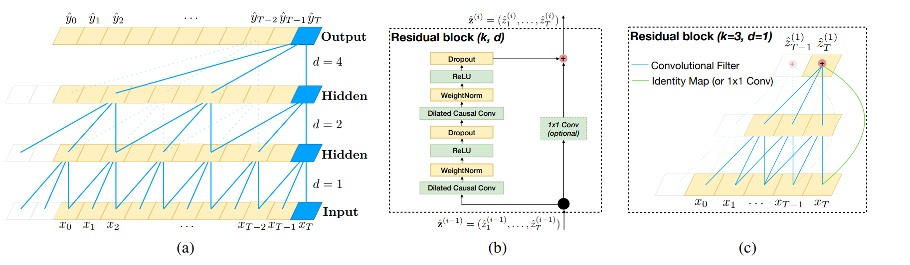
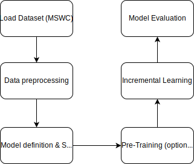
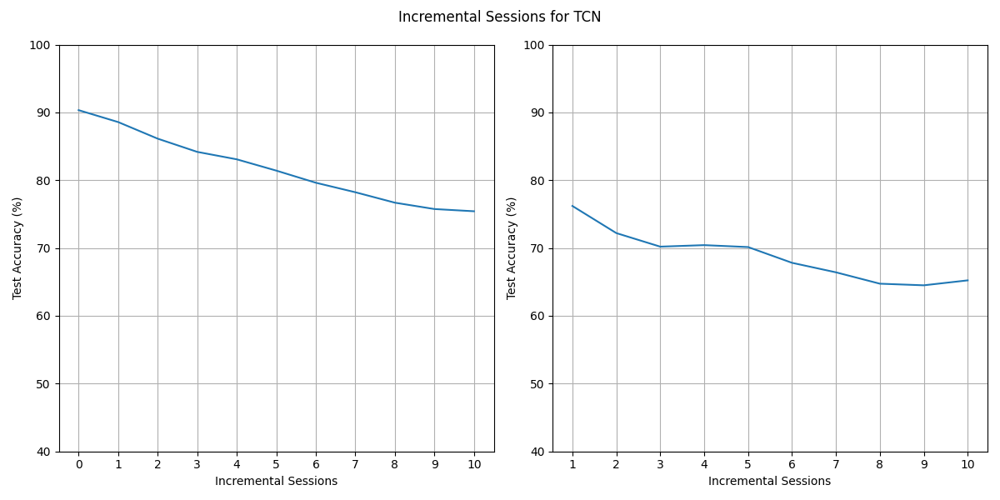

# neurobench_reproducible blog requirements

## Introduction

## Reproduced

## Hyperparams check

## New algorithm variant
### A brief introduction to TCN
Temporal Convolutional Networks (TCNs) are a class of neural network architectures specifically designed for processing sequential data efficiently. They have gained significant attention due to their ability to capture long-range dependencies in sequences while overcoming some limitations of traditional recurrent neural networks (RNNs) like vanishing gradients and difficulty in parallelization.

**Architecture**: TCNs consist of a series of one-dimensional convolutional layers, followed by non-linear activation functions and pooling layers. The key components of TCNs include:
- **Convolutional Layers**: TCNs employ one-dimensional convolutional layers to process sequential data. These layers apply a set of learnable filters across different segments of the input sequence, enabling the network to capture local patterns efficiently.

- **Dilated Convolutions**: A key feature of TCNs is the use of dilated (or atrous) convolutions. Dilated convolutions allow the receptive field of the network to grow exponentially with depth without increasing the number of parameters or computational cost linearly. This enables TCNs to capture information from a broader context of the input sequence, making them adept at modeling long-range dependencies.

- **Residual Connections**: TCNs often incorporate residual connections, similar to those used in ResNet architectures. These connections facilitate the training of very deep networks by mitigating the vanishing gradient problem and improving information flow through the network.

*Figure 1. Architectural elements in a TCN.  (a) A dilated causal convolution. (b) TCN residual block. (c) An example of residual connection in a TCN. The blue lines are filters in the residual
function, and the green lines are identity mappings.*

**Advantages**: TCNs offer several advantages over traditional RNNs, including:
- **Parallelization**: Unlike RNNs, TCNs can process sequences in parallel, making them computationally efficient and well-suited for training on modern hardware like GPUs.
- **Long-Range Dependencies**: TCNs excel at capturing dependencies across a wide range of time steps due to the receptive field expansion enabled by dilated convolutions.
- **Stability and Training**: TCNs are generally easier to train compared to RNNs, as they do not suffer from vanishing gradient problems inherent in deep recurrent architectures.

### Pipeline
The machine learning pipeline consists of the following sequential stages:

**a. Data Preprocessing**

The first phase of the pipeline involves preprocessing raw audio data using Mel-frequency cepstral coefficients (MFCC) conversion to extract meaningful features for TCN input. This process transforms the audio signals into a series of feature vectors suitable for sequence modeling tasks. Additionally, the dataset (MSWC) is loaded and prepared using data loaders to facilitate efficient batch processing during model training and testing.

**b. Model Definition and Initialization**

The TCN model architecture is defined and initialized with specific parameters, including the input size, output size, number of layers, kernel sizes, and additional configurations such as batch normalization and dropout.

**c. Pre-training Phase**

During the (optional) pre-training phase, the TCN model is trained on the base dataset (MSWC) for a specified number of epochs using optimization techniques such as the Adam optimizer with learning rate scheduling (StepLR). The training process aims to optimize the model parameters to minimize a defined loss function (e.g., cross-entropy) and enhance its ability to capture temporal dependencies in sequential data.

**d. Incremental Learning Phase**

Following (optional) pre-training, the pre-trained TCN model undergoes incremental learning to adapt and extend its capabilities for handling new classes or tasks over multiple learning sessions (NUM_REPEATS). This phase involves specialized strategies for continual learning, such as modifying the TCN readout layer to accommodate new class additions and updating model parameters incrementally based on incoming data.

**e. Model Evaluation**

Throughout the pipeline, the trained TCN model is evaluated using both training and testing datasets to assess its performance and generalization ability. Evaluation metrics such as classification accuracy, activation sparsity, and synaptic operations are computed to quantify the model's effectiveness in sequence modeling tasks. Evaluation is conducted at various checkpoints to monitor model progress and identify potential areas for improvement. The neurobench library is used for evaluation. We also implemented our own evaluation function as described in the new code variant section.

### Results

## New code variant

## Conclusion
