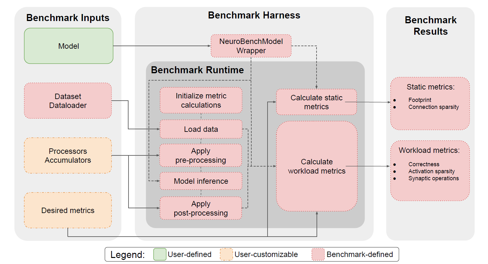
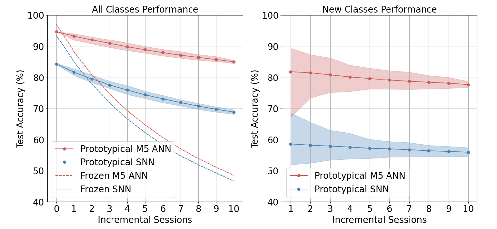
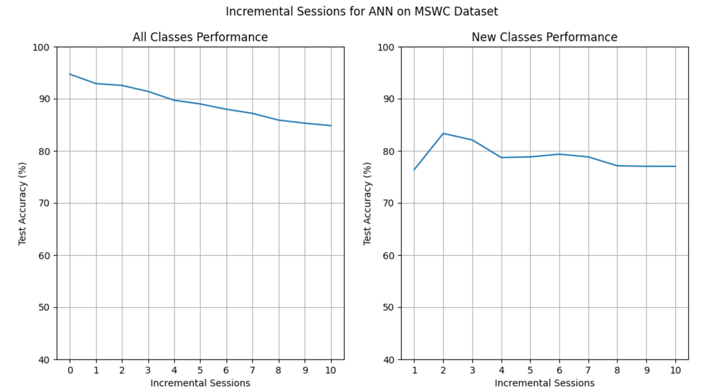

# neurobench_reproducible

This repository contains the reproducible project for CS4240 group 40, the paper being reproduced is [NeuroBench: A Framework for Benchmarking
Neuromorphic Computing Algorithms and Systems](https://arxiv.org/abs/2304.04640)

# NeuroBench: A Framework for Benchmarking Neuromorphic Computing Algorithms and Systems

Recent years, the need for an evaluating system like NeuroBench in neuromorphic computing arises from the lack of standardized benchmarks in the field, making it challenging to accurately measure technological advancements, compare performance with conventional methods, and identify promising future research directions. In this blog, a new evaluation system for neuromorphic computing algorithms, NeuroBench, is introduced. We aim to provide the reader with a clear picture of the function of NeuroBench by explaining the structure of it, testing its efficiency on M5 Artificial Neural Network (M5 ANN) and Temporal Convolutional Network (TCN), and analyzing its advantages towards traditional evaluation metrics. 
  
In our reproducibility project, we mainly used 4 criteria to reproduce the paper: **Reproduced**, **Hyperparams check**, **New algorithm variant**, **New code variant**. We first used the existing M5 ANN codes on the github website of NeuroBench to evaluate the proposed benchmark - Keyword Few-Shot Class-Incremental Learning (FSCIL). Then we substituted the ANN with a new algorithm, TCN, to check the generalizability of the benchmark. After that, we tuned the hyperparams of the network and changed the benchmark metrics with our own testing function to evaluate the results. During the course of the project, we also found a memory overflow problem in the codes which is provided by the authors of the article. We reflected it to the authors and had the bug get fixed.

The project team engaged in a collaborative problem-solving process to identify and address the key challenges associated with the source codes and the variant codes. Through a joint effort, the team was able to effectively define and tackle the reporduction and the new algorithm and code variation.

# Reproduced
## a.	NeuroBench
NeuroBench is a benchmark framework designed for evaluating neuromorphic computing algorithms and systems, aiming to standardize the assessment of neuromorphic approaches in both hardware-independent and hardware-dependent settings. The advantages of NeuroBench lie in its inclusive and systematic methodology, providing a common set of tools for benchmark measurement that allows for objective comparisons between different neuromorphic models. By offering a structured framework for evaluation, NeuroBench facilitates the measurement of performance, enables comparisons with conventional methods, and helps identify promising research directions in the field of neuromorphic computing.

 
**Figure 1. Two main tracks of NeuroBench [1]**

The structure of NeuroBench, as depicted in Fig 1 of the article, consists of two tracks: the algorithm track and the system track. The algorithm track focuses on hardware-independent algorithm prototyping to identify promising methods, which inform system design for optimization and relevant benchmarking. On the other hand, the system track enables the optimization and evaluation of performant implementations, providing feedback to refine algorithmic complexity modeling and analysis. The interplay between these tracks creates a virtuous cycle where algorithm innovations guide system implementation, and system-level insights accelerate further algorithmic progress, ultimately advancing neuromorphic algorithm-system co-design.
In our project, we mainly focus on the algorithm track, using all the metrics NeuroBench provided to evaluate different models.

 
**Figure 2. An overview of the NeuroBench algorithm track [1]**

The algorithm track of NeuroBench aims to evaluate algorithms in a hardware-independent manner, separating algorithm performance from specific implementation details. As shown in Fig 2, this track provides a framework for assessing algorithm correctness on specific tasks and capturing general metrics that reflect the architectural complexity, computational demands, and storage requirements of the models. The algorithm track establishes solution-agnostic primary metrics that are generally relevant to all types of solutions, including artificial and spiking neural networks (ANNs, SNNs). These metrics include correctness metrics, such as accuracy, mean average precision (mAP), and mean-squared error (MSE), as well as complexity metrics like footprint, which measures the memory footprint required to represent a model. By defining these metrics and providing a common infrastructure for benchmarking, the algorithm track enables researchers to evaluate and compare different neuromorphic algorithms objectively, facilitating advancements in the field.

## b.	Keyword FSCIL and M5 ANN
The task Keyword FSCIL in the NeuroBench algorithm track evaluates the capacity of a model to successively incorporate new keywords over multiple sessions with only a handful of samples from the new classes to train with. This task is designed to mimic the ability of biological intelligence to adapt to new information while retaining knowledge of prior tasks, especially in edge devices. The benchmark uses streaming audio data from the Multilingual Spoken Word Corpus (MSWC) for keyword classification.
For the Keyword FSCIL task, the M5 ANN baseline is utilized. The M5 ANN is a tuned version of the M5 deep convolutional network architecture, where samples are pre-processed into Mel-frequency cepstral coefficients (MFCC). The network consists of four successive convolution-normalization-pooling layers followed by a readout fully-connected layer. During each model execution (forward pass), the data from the full pre-processed sample is used, and convolution kernels are applied over the temporal dimension of the samples.
This benchmark task involves two phases: pre-training and incremental learning. Initially, a set of 100 words from 5 base languages with 500 training samples each is used for pre-training the model. Subsequently, the model undergoes 10 successive sessions to learn words from 10 new languages in a few-shot learning scenario, with only 5 training samples available per word. The model is tested after each session on all previously learned classes, evaluating its ability to learn new classes while retaining knowledge of prior ones. By the end of the benchmark, the model is expected to have knowledge of 200 keywords.

## c.	Reproduction result

**Figure 3. Test accuracy per session on the keyword FSCIL task for prototypical and frozen baselines, with the accuracy on both base classes and incrementally-learned classes (left), and accuracy on all incrementally-learned classes only (right). [1]**

**Figure 4. Reproduced test accuracy performance**

The basic requirement of this project is to reproduce the red curve (Prototypical M5 ANN) as shown in Fig 3. After pre-training using standard batched training, the ANN baseline network reaches high accuracies on the base classes of 97.09%. Using prototypical networks, the ANN model reaches 89.27% accuracy on average over all sessions The accuracy on new classes, averaged over all incremental sessions, is 79.61%. It is worth-mentioned that the authors run the entire algorithm 100 times to draw the figure 3. Therefore, the shaded area can be seen in the figure, representing the 5th and 95th percentile on the 100 runs.
However, due to the limitation of the computing power, we only reproduced 1 run. From figure 4 we can see that, the all-class performance also reaches 95% accuracy and the averaged accuracy on new classes over all incremental sessions is also around 80%. Such curve results are in high agreement with those obtained by the authors, proving the success of our reproduced code

## d.	Memory overflowing
At the very beginning, we found a problem that keeps preventing us from continuing reproduce the project. The GPU memory of our laptops will always explode in the pretrain phase after 1 or 2 epochs. Then we tried the example from the NeuroBench Github website, both M5 ANN and SNN. We trained them on GPU, the memory will explode during the testing phase in the first epoch. If we use CPU to train the model, things get a little bit better. CPU can finish the first epoch, however, in the training phase in the second epoch, the memory exploded again. 
We first thought our laptops lack arithmetic power because our most powerful GPUs only have 8G of memory space. Then the extremely large CPU memory (40G) also ended up with killing itself with the memory usage 35G/40G. We started to think that maybe some fundamental settings or configurations needed to be changed on our laptops, or maybe some changes are needed for the example code. 
We reported this bug to one of the authors of this article. After he discussed this problem with his co-workers, they finally found the problem of memory overflowing and modified the codes to fix it.

# References
[1] 	arXiv:2304.04640

